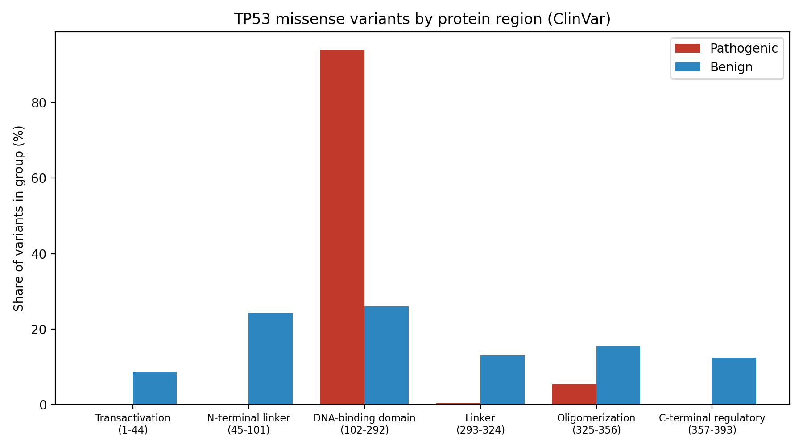
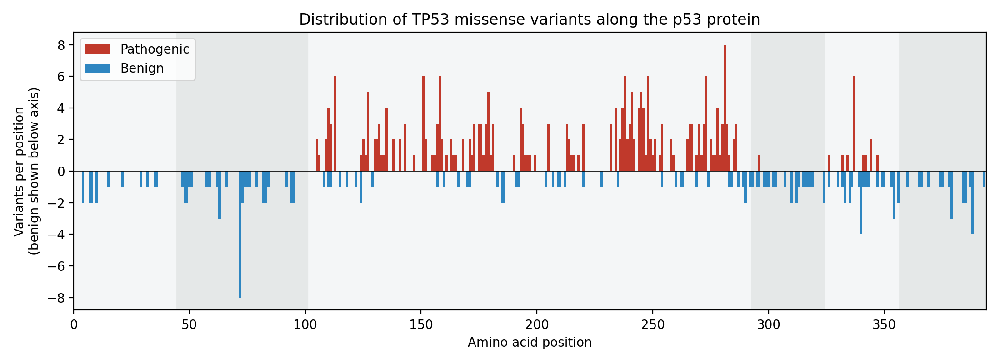

# TP53 Variant Landscape: Domain-Level Analysis of ClinVar Missense Variants

A reproducible Python analysis of how pathogenic and benign missense variants in the tumor suppressor gene **TP53** are distributed across the functional regions of the p53 protein.

## Overview

*TP53* is the most frequently mutated gene in human cancer, and germline variants cause Li-Fraumeni syndrome. This project integrates variant classifications from **ClinVar** with region annotations from **UniProt (P04637)** to ask where clinically significant variants cluster along the 393-residue p53 protein.

## Key Finding

Of 256 pathogenic/likely pathogenic and 161 benign/likely benign TP53 missense variants, **94.1% of pathogenic variants (241/256) fall within the DNA-binding domain (residues 102-292)**, compared with 26.1% of benign variants (42/161).

| Region (residues) | Pathogenic | Benign | Pathogenic (%) | Benign (%) |
|---|---:|---:|---:|---:|
| Transactivation (1-44) | 0 | 14 | 0.0 | 8.7 |
| N-terminal linker (45-101) | 0 | 39 | 0.0 | 24.2 |
| **DNA-binding domain (102-292)** | **241** | **42** | **94.1** | **26.1** |
| Linker (293-324) | 1 | 21 | 0.4 | 13.0 |
| Oligomerization (325-356) | 14 | 25 | 5.5 | 15.5 |
| C-terminal regulatory (357-393) | 0 | 20 | 0.0 | 12.4 |

A Fisher's exact test comparing the DNA-binding domain with the rest of the protein gave an odds ratio of 45.5 (p = 3.1 x 10^-50).





Positions with recurrent pathogenic variants include residues 113, 151, 158, 238, 248, 273, 281 and 337. Most lie in the DNA-binding domain; residue 337 lies in the oligomerization domain.

## Research Question

Are pathogenic TP53 missense variants concentrated in specific functional regions of p53, and how does their positional distribution differ from that of benign variants?

## Data Sources

| Source | Content | Use |
|---|---|---|
| [ClinVar](https://www.ncbi.nlm.nih.gov/clinvar/) | Germline variant classifications and review status | Pathogenic and benign TP53 missense variants |
| [UniProt P04637](https://www.uniprot.org/uniprotkb/P04637) | Region and DNA-binding annotations | Mapping variants to protein regions |

Region boundaries used (UniProt P04637): transcription activation 1-44, DNA-binding 102-292, oligomerization 325-356. The intervals between these annotated regions (45-101, 293-324, 357-393) are grouped as linker/flanking regions as an analytical choice; they are not UniProt-annotated domains.

## Methods

1. **Cleaning (`scripts/clean_data.py`)**: Parse the ClinVar export, keep variants on the canonical transcript (NM_000546.6), extract amino acid positions from the variant name, and classify germline classifications as Pathogenic (pathogenic and likely pathogenic), Benign (benign and likely benign), VUS, or Conflicting. Protein positions are taken from the variant name rather than the "Protein change" column, which lists multiple isoform numberings.
2. **Mapping and statistics (`scripts/map_domains.py`)**: Assign each pathogenic/benign variant to a protein region, tabulate counts and percentages, test enrichment in the DNA-binding domain with Fisher's exact test, and generate figures.

Of 1,522 records in the ClinVar export, 1,490 were missense variants with a defined protein position on the canonical transcript. Variants of uncertain significance (611) and with conflicting classifications (450) were excluded from the pathogenic-versus-benign comparison.

## Limitations

- ClinVar is dominated by **germline** variants submitted from clinical testing. The results describe how variants are *classified clinically*, not the spectrum of somatic mutations in tumors.
- ClinVar is subject to **submission bias**: well-studied positions and variants are over-represented.
- A "pathogenic" classification reflects the evidence available to submitters and is not equivalent to experimental proof of pathogenicity. Review status was not used as a filter in this version.
- Variants of uncertain significance and conflicting classifications were excluded, so the comparison reflects only variants with a clear classification.
- Linker regions are defined by this analysis and are not UniProt domains.
- Counts are not normalized for region length or for the number of possible missense substitutions per region.

## Repository Structure

```
Tp53-variant-landscape/
├── scripts/
│   ├── clean_data.py       # ClinVar cleaning and classification
│   └── map_domains.py      # Region mapping, statistics, figures
├── figures/
│   ├── variants_by_region.png
│   └── variants_along_protein.png
├── domain_counts.csv       # Counts and percentages per region
├── requirements.txt
└── README.md
```

## Reproducibility

```bash
git clone https://github.com/Parmida-Mehranfarid/Tp53-variant-landscape.git
cd Tp53-variant-landscape
pip install -r requirements.txt
```

1. Download TP53 variants from ClinVar (gene: TP53, filter: missense variant) as a tabular file and save it as `data/raw/clinvar_tp53_missense.txt`.
2. Run `python scripts/clean_data.py`.
3. Run `python scripts/map_domains.py`.

The scripts write their outputs to `data/processed/` and `results/`. The raw ClinVar file is not tracked in this repository.

## Future Work

- Add somatic TP53 mutation data from tumor sequencing resources for comparison with germline classifications.
- Normalize counts by region length and by the number of possible substitutions.
- Examine hotspot residues and substitution types in more detail.
- Filter by ClinVar review status to assess robustness.

## Author

Parmida Mehranfarid, B.Sc. student in Cellular and Molecular Biology
